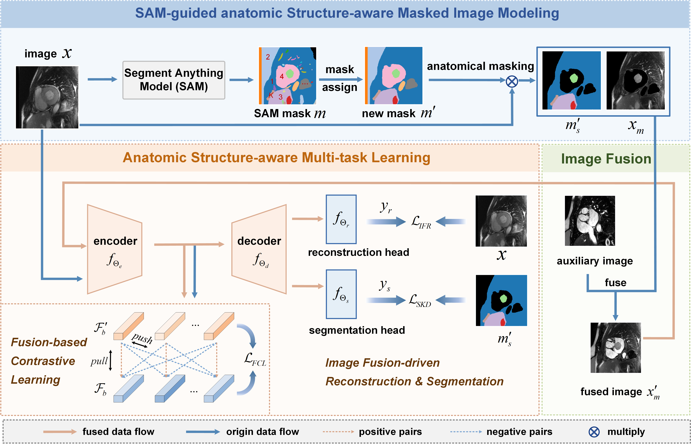

# FDAS: Foundation Model Distillation and Anatomic Structure-aware Multi-task Learning for Self-Supervised Medical Image Segmentation
---
This repository provides the code for our MICCAI 2025 paper "FDAS: Foundation Model Distillation and Anatomic Structure-aware Multi-task Learning for Self-Supervised Medical Image Segmentation"


## ✨Overall Framework



## 🔨Usage
### Download dataset
1. Download the [M&MS Dataset](http://www.ub.edu/mnms), and organize the dataset directory structure as follows. 
```
your/data_root/
       train/
            img/
                full/      # 100% of the training images
                    A0S9V9_0.nii.gz
                    ...
                subset20/  # 20% of the training images
                subset10/  # 10% of the training images
                ...
            lab/
                full/
                    A0S9V9_0_gt.nii.gz
                    ...
                subset20/
                subset10/
                ...
       valid/
            img/
            lab/
       test/
           img/
           lab/
```
2. Download the [SAM model](https://github.com/facebookresearch/segment-anything?tab=readme-ov-file#model-checkpoints) and move the model to the "your_root/pretrained_model" directory in your project.

### Pre-processing data
3. Generate masks using the Segment Anything Model (SAM)
```
generate_masks.py
```
4. Pre-process the masks generated from SAM
```
pre_process.py
```
### Pre-training
5. Pre-train the network using pre_train.py
```
pre_train.py
```
### Fine-tuning
6. Fine-tune the network using fine_tune.py
```
fine_tune.py
```

## 🤝 Acknowledgement
- Parts of our codebase are adapted from [PyMIC](https://github.com/HiLab-git/PyMIC.git). We also thank the authors of the [Segment Anything](https://github.com/facebookresearch/segment-anything) project for open-sourcing their code.
